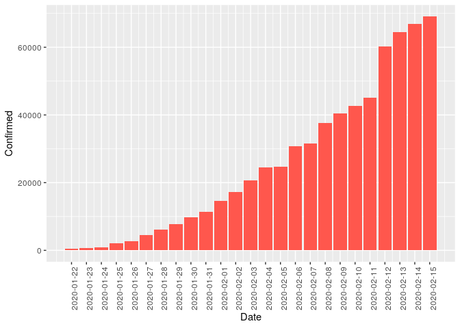
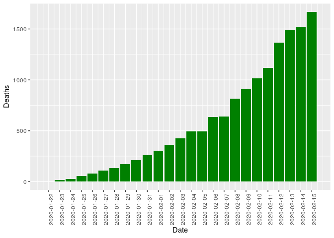

Corona Vírus
================

Um vírus que foi relatado pela primeira vez na cidade chinesa de Wuhan,
agora se espalhou para mais de uma dúzia de países em todo o mundo,
provocando uma crise econômica e de saúde sem precedentes. A Organização
Mundial da Saúde (OMS) declarou o surto do coronavírus uma emergência de
saúde pública de interesse mundial.

Vamos dá uma breve olhada na crise atual e depois nos aprofundaremos no
“Novel Corona Virus 2019 Dataset” do Kaggle.

## O que é um coronavírus?

Segundo a OMS, os coronavírus (CoV) são uma grande família de vírus que
causam doenças que variam do resfriado comum a doenças mais graves, como
a Síndrome Respiratória do Oriente Médio (MERS-CoV) e a Síndrome
Respiratória Aguda Grave (SARS-CoV). Um novo coronavírus (nCoV) é uma
nova cepa que não foi previamente identificada em humanos. O vírus
identificado como a causa do surto recente está sendo chamado de
coronavírus 2019-nCoV ou Wuhan.

# A crise, a partir de hoje

De acordo com o último relatório do New York Times, “o número de
infecções confirmadas subiu para 37.198 e o número de mortos na China
aumentou para 811, superando o número de mortos pela epidemia de SARS.”

Dezesseis cidades na China, com uma população combinada de mais de 50
milhões de pessoas, estão confinadas. As companhias aéreas de todo o
mundo cancelaram voos de ida e volta dá China.

Alguns países estão evacuando seus cidadãos em vôos especiais e os
colocando em quarentena rigorosa (Brasil por exemplo). Para piorar, as
bolsas de valores caíram na China e os mercados em todo o mundo estão
sentindo os efeitos. Alguns analistas prevêem que o surto representa uma
ameaça para a economia global, e que tem o potencial de desencadear
conseqüências geopolíticas de longo alcance.

# Uma introdução ao conjunto de dados

O Conjunto de dados do “Novel Corona Virus 2019”, publicado no Kaggle
(<https://www.kaggle.com/sudalairajkumar/novel-corona-virus-2019-dataset>),
foi coletado pela John Hopkins University. A equipe coletou os dados de
várias fontes, como a OMS, CDC local e meios de comunicação. Eles também
criaram um painel em tempo real para monitorar a propagação do vírus.

# Importando e Carregando os Dados

``` r
dados<-read.table('cv.csv', sep = ',', header = T)
```

# Compreendendo o conjunto de dados

Vamos primeiro obter um entendimento básico do conjunto de dados e
executar operações de limpeza de dados, se necessário.

``` r
library(dplyr)
```

    ## 
    ## Attaching package: 'dplyr'

    ## The following objects are masked from 'package:stats':
    ## 
    ##     filter, lag

    ## The following objects are masked from 'package:base':
    ## 
    ##     intersect, setdiff, setequal, union

``` r
dados %>% head()
```

    ##   Sno                Date Province.State Country         Last.Update Confirmed
    ## 1   1 01/22/2020 12:00:00          Anhui   China 01/22/2020 12:00:00         1
    ## 2   2 01/22/2020 12:00:00        Beijing   China 01/22/2020 12:00:00        14
    ## 3   3 01/22/2020 12:00:00      Chongqing   China 01/22/2020 12:00:00         6
    ## 4   4 01/22/2020 12:00:00         Fujian   China 01/22/2020 12:00:00         1
    ## 5   5 01/22/2020 12:00:00          Gansu   China 01/22/2020 12:00:00         0
    ## 6   6 01/22/2020 12:00:00      Guangdong   China 01/22/2020 12:00:00        26
    ##   Deaths Recovered
    ## 1      0         0
    ## 2      0         0
    ## 3      0         0
    ## 4      0         0
    ## 5      0         0
    ## 6      0         0

Os nomes das colunas são auto-explicativos. A primeira coluna ‘Sno’ se
parece com um número de linha e não agrega valor à análise. A quinta
coluna ‘Última atualização’ mostra o mesmo valor que a coluna ‘Data’,
exceto em alguns casos em que os números foram atualizados
posteriormente. Então, irei remover essas duas colunas antes de
continuar.

``` r
dados<-dados[,c(-1,-5)]
dados %>% head()
```

    ##                  Date Province.State Country Confirmed Deaths Recovered
    ## 1 01/22/2020 12:00:00          Anhui   China         1      0         0
    ## 2 01/22/2020 12:00:00        Beijing   China        14      0         0
    ## 3 01/22/2020 12:00:00      Chongqing   China         6      0         0
    ## 4 01/22/2020 12:00:00         Fujian   China         1      0         0
    ## 5 01/22/2020 12:00:00          Gansu   China         0      0         0
    ## 6 01/22/2020 12:00:00      Guangdong   China        26      0         0

Se fizer uma análise mais aprofundada, a base de dados mostra que faltam
nomes de províncias para países como Reino Unido, França e Índia. Nesse
caso, não podemos assumir ou preencher valores ausentes de nenhuma
observação.

``` r
dados %>% summary()
```

    ##                   Date        Province.State           Country   
    ##  02/14/2020 22:00:00:  75            : 418   Mainland China:739  
    ##  02/15/2020 22:00:00:  75   Anhui    :  25   US            :166  
    ##  02/13/2020 21:15:00:  74   Beijing  :  25   Australia     : 76  
    ##  02/11/2020 20:44:00:  73   Chongqing:  25   Canada        : 53  
    ##  02/12/2020 22:00:00:  73   Fujian   :  25   China         : 34  
    ##  02/07/2020 20:24:00:  72   Gansu    :  25   Japan         : 25  
    ##  (Other)            :1127   (Other)  :1026   (Other)       :476  
    ##    Confirmed         Deaths           Recovered      
    ##  Min.   :    0   Min.   :   0.000   Min.   :   0.00  
    ##  1st Qu.:    2   1st Qu.:   0.000   1st Qu.:   0.00  
    ##  Median :   12   Median :   0.000   Median :   0.00  
    ##  Mean   :  406   Mean   :   9.121   Mean   :  33.66  
    ##  3rd Qu.:  101   3rd Qu.:   0.000   3rd Qu.:   5.00  
    ##  Max.   :56249   Max.   :1596.000   Max.   :5623.00  
    ## 

Fazendo uma rápida análise descritiva, usando a função summary()

A função summary() retorna as estatísticas gerais das colunas da base de
dados. Uma conclusão imediata da saída é que os dados foram relatados
cumulativamente, ou seja, o número de casos relatados em um determinado
dia inclui os casos relatados anteriormente. O valor ‘máximo’ de mortes
é 1596, o que é consistente com os relatos da mídia há alguns dias
(quando esses dados foram publicados
    15/02/2020).

``` r
dados[,3] %>% unique()
```

    ##  [1] China                US                   Japan               
    ##  [4] Thailand             South Korea          Mainland China      
    ##  [7] Hong Kong            Macau                Taiwan              
    ## [10] Singapore            Philippines          Malaysia            
    ## [13] Vietnam              Australia            Mexico              
    ## [16] Brazil               France               Nepal               
    ## [19] Canada               Cambodia             Sri Lanka           
    ## [22] Ivory Coast          Germany              Finland             
    ## [25] United Arab Emirates India                Italy               
    ## [28] Sweden               Russia               Spain               
    ## [31] UK                   Belgium              Others              
    ## [34] Egypt               
    ## 34 Levels: Australia Belgium Brazil Cambodia Canada China Egypt ... Vietnam

Os dados mostram que o vírus se espalhou para 33 países da Ásia, Europa
e América. Para facilitar essa análise, podemos mesclar dados para
‘China’ e ‘Mainland China’. (Others não é um país e sim a contagem dos
valores em brancos).

``` r
dados[which(dados[,3]=='Mainland China'),3]<-'China'
dados[,3] %>% unique()
```

    ##  [1] China                US                   Japan               
    ##  [4] Thailand             South Korea          Hong Kong           
    ##  [7] Macau                Taiwan               Singapore           
    ## [10] Philippines          Malaysia             Vietnam             
    ## [13] Australia            Mexico               Brazil              
    ## [16] France               Nepal                Canada              
    ## [19] Cambodia             Sri Lanka            Ivory Coast         
    ## [22] Germany              Finland              United Arab Emirates
    ## [25] India                Italy                Sweden              
    ## [28] Russia               Spain                UK                  
    ## [31] Belgium              Others               Egypt               
    ## 34 Levels: Australia Belgium Brazil Cambodia Canada China Egypt ... Vietnam

Antes de avançar, vamos verificar o formato das datas na coluna ‘Data’.

``` r
dados[,1] %>% head()
```

    ## [1] 01/22/2020 12:00:00 01/22/2020 12:00:00 01/22/2020 12:00:00
    ## [4] 01/22/2020 12:00:00 01/22/2020 12:00:00 01/22/2020 12:00:00
    ## 25 Levels: 01/22/2020 12:00:00 01/23/2020 12:00:00 ... 02/15/2020 22:00:00

Parece que os dados foram atualizados em horários diferentes a cada dia.
Podemos extrair as datas do registro de data e hora e usá-las para
análises adicionais. Isso nos ajudará a manter as datas uniformes.

``` r
library(lubridate)
```

    ## 
    ## Attaching package: 'lubridate'

    ## The following object is masked from 'package:base':
    ## 
    ##     date

``` r
d<- as.character(dados[,1])
d<-mdy_hms(d)
dados[,1] <- as.Date(d, "%d:%m:%Y")
dados[,1] %>% head()
```

    ## [1] "2020-01-22" "2020-01-22" "2020-01-22" "2020-01-22" "2020-01-22"
    ## [6] "2020-01-22"

Agora vamos ter uma noção do impacto do surto em cada país.

``` r
dados %>%group_by(Country) %>%
  summarise(Confirmed=max(Confirmed), Deaths=max(Deaths), Recovered = max(Recovered))
```

    ## # A tibble: 33 x 4
    ##    Country   Confirmed Deaths Recovered
    ##    <fct>         <dbl>  <dbl>     <dbl>
    ##  1 Australia         5      0         4
    ##  2 Belgium           1      0         0
    ##  3 Brazil            0      0         0
    ##  4 Cambodia          1      0         1
    ##  5 Canada            4      0         1
    ##  6 China         56249   1596      5623
    ##  7 Egypt             1      0         0
    ##  8 Finland           1      0         1
    ##  9 France           12      1         4
    ## 10 Germany          16      0         1
    ## # … with 23 more rows

  - Alto número de casos na China

  - Alto número de mortes na China

  - China e França foram os únicos países com mortes confirmadas

  - Não houve casos confirmados no Brasil

# Plotando os dados

Para visualização dos dados, usaremos três poderosos pacotes do R:
ggplot2, dplyr e tidyr.

1 - Número de casos confirmados ao longo do tempo

``` r
library(ggplot2)
ggplot(dados, aes(Date, Confirmed)) + geom_col(fill = "#ff574d") +
  scale_x_date(breaks = unique(dados[,1])) +
  theme(axis.text.x.bottom = element_text(angle = 90, hjust = 0))
```

<!-- -->

Pelo gráfico acima, conseguimos ver mais de 60000 casos confirmados.

1.2 - Número de mortes confirmados ao longo do tempo

``` r
ggplot(dados, aes(Date, Deaths)) + geom_col(fill = "#008000") +
  scale_x_date(breaks = unique(dados[,1])) +
  theme(axis.text.x.bottom = element_text(angle = 90, hjust = 0))
```

<!-- -->

Pelo gráfico acima, conseguimos ver mais de 1500 mortes.

1.3 - Número de casos recuperado ao longo do tempo

``` r
ggplot(dados, aes(Date, Recovered)) + geom_col(fill = "#5390fe") +
  scale_x_date(breaks = unique(dados[,1])) +
  theme(axis.text.x.bottom = element_text(angle = 90, hjust = 0))
```

<!-- -->

Pelo gráfico acima, conseguimos ver mais de 7500 casos de pessoas
recuperadas.

1.4 - Todos os casos ao longo do tempo

``` r
library(tidyr)
dados %>%
  gather(Casos, Quantidade, -Province.State, -Date,-Country) %>% ggplot(aes(Date, Quantidade, fill=Casos)) + geom_bar(stat = "identity", position = "dodge") +
  scale_x_date(breaks = unique(dados[,1])) +
  theme(axis.text.x.bottom = element_text(angle = 90, hjust = 0))
```

<!-- -->

2.  Mortes e Recuperados

Diante todo o caos, podemos retirar uma noticia boa. Os casos de pessoas
recuperadas já superam e muito o número de mortos.

``` r
library(tidyr)
mxr<-dados %>% gather(Casos, Quantidade, -Province.State, -Date,-Country) 

mxr<-mxr[mxr$Casos!='Confirmed',]

mxr%>% ggplot(aes(Date, Quantidade, fill=Casos)) + geom_bar(stat = "identity", position = "dodge") +
  scale_x_date(breaks = unique(dados[,1])) +
  theme(axis.text.x.bottom = element_text(angle = 90, hjust = 0))
```

<!-- -->

3.  Um olhar mais atento às 10 províncias mais afetadas da China

<!-- end list -->

``` r
dados_china<-dados[which(dados[,3]=='China'),]
dados_china %>%group_by(Province.State) %>%
  summarise(Confirmed=max(Confirmed), Deaths=max(Deaths), Recovered = max(Recovered))%>%
  arrange(desc(Confirmed))
```

    ## # A tibble: 34 x 4
    ##    Province.State Confirmed Deaths Recovered
    ##    <fct>              <dbl>  <dbl>     <dbl>
    ##  1 Hubei              56249   1596      5623
    ##  2 Guangdong           1294      2       410
    ##  3 Henan               1212     13       391
    ##  4 Zhejiang            1162      0       428
    ##  5 Hunan               1001      2       425
    ##  6 Anhui                950      6       221
    ##  7 Jiangxi              913      1       210
    ##  8 Jiangsu              604      0       186
    ##  9 Chongqing            544      5       184
    ## 10 Shandong             532      2       156
    ## # … with 24 more rows

# Observações

  - A província chinesa de Hubei é o epicentro do surto. Tem
    significativamente mais casos relatados do que todas as outras
    províncias juntas. Existem algumas províncias onde não houve mortes
    e todos os pacientes afetados se recuperaram.

  - O número de casos relatados diariamente aumentou quase 500% desde 22
    de janeiro. Isso mostra que o vírus é altamente contagioso e está se
    espalhando rapidamente.

  - Durante a primeira semana, a taxa de mortes foi superior à das
    recuperações. Desde 31 de janeiro, a taxa de recuperação disparou e
    está mostrando uma tendência positiva. Houve 255 recuperações no dia
    4 de fevereiro, em comparação com 66 mortes. A taxa de recuperação
    continuará a aumentar à medida que mais pessoas conhecerem os
    sintomas e forem rápidas na procura de medicamentos.

  - Países geograficamente próximos à China, como Tailândia, Japão e
    Cingapura, relataram mais casos do que outros países asiáticos e
    europeus. A Alemanha é uma exceção e tem o maior número de casos na
    Europa.

# Conclusão

A análise mostra a taxa alarmante na qual o coronavírus está se
espalhando. Pelo menos 1590 pessoas já morreram durante a atual
epidemia, excedendo as 774 mortes relatadas durante o surto de SARS há
sete anos.
